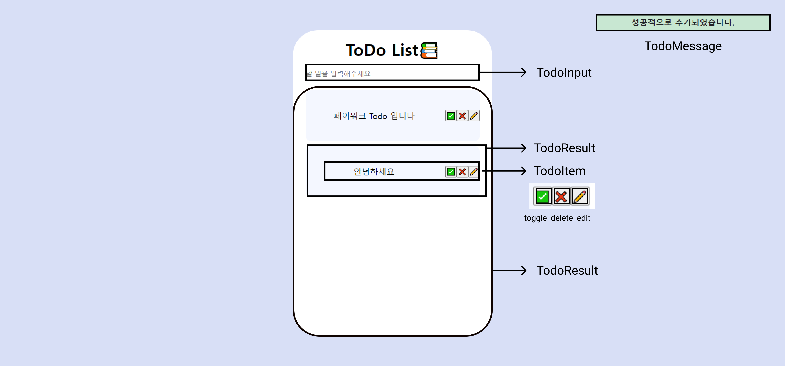

# 리액트를 이용한

배포 사이트 : https://todolist-clients.herokuapp.com/

**로컬환경보다 훨씬 느리게 동작합니다**

### 1. 기술 스택 및 구조

 

**Frontend**

 

**Backend (Local)**

 

**Depoly**

### 2. 로컬 실행 방법 (이전버전)

**현재 BASE_URL이 `http://localhost:8080` 로 설정되어 있습니다. 로컬 웹서버를 사용하셔서 테스트 하는 방법은 아래와 같습니다.**

- 클라이언트 : `npm start`
- 서버 : `cd server -> npm start`

**만약 `http://dummy-server.io/` 로 테스트 하실 경우**

- **package.json 의 proxy 부분을 삭제**
- **src/constant.js 부분에서 BASE_URL을 `http://dummy-server.io/`로 교체해주시면 감사하겠습니다.**

### 3. 구현 컴포넌트

 

 

#### **컴포넌트 목록**

|  컴포넌트   | 구현여부 |
| :---------: | :------: |
|  TodoItem   |    O     |
|  TodoInput  |    O     |
| TodoResult  |    O     |
| TodoMessage |    O     |
| TodoButton  |    X     |
| TodoFotter  |    X     |

#### **컴포넌트 설명**

 

**1. TodoItem**

- 서버에서 내용을 받아와 todolist의 내용을 보여줍니다.
- toggle , delete , edit을 할 수 있지만, 단순히 redux-saga에 action을 발행하는 함수이지, 로직이 컴포넌트 내부에서 실행되지는 않습니다.

- 연필 버튼을 누르면 수정 / 엔터키로 수정을 마무리합니다.

**2. TodoInput**

- 새로운 todolist를 작성할 수 있는 컴포넌트입니다.

**3. TodoResult**

- 서버로부터 받아온 결과를 보여주는 컴포넌트입니다.

- 게시글이 존재하지 않을 경우 비어있다는 것을 나타내는 이미지가 등장합니다.

**4. TodoMessage**

- 게시글 추가, 편집, 삭제에 성공/실패 할 경우 오른쪽 상단에 메시지가 발생합니다.

### 4. 구현 기능

|      기능       | 구현여부 |
| :-------------: | :------: |
|    기본 CURD    |    O     |
|   메시지 토글   |    O     |
|  메시지 날리기  |    O     |
|   무한 스크롤   |    X     |
| 게시글 저장하기 |    X     |

### 5. 발생하는 오류

- 여러가지의 동작이 수 초 내에 여러번 반복될 때 제대로 메시지가 나타나지 않는다는 문제가 있습니다.

### 6. git 커밋 메시지 규칙

- feat : 새로운 기능에 대한 커밋
- fix : 오류 및 버그 수정
- build : 빌드 관련 파일 수정에 대한 커밋
- chore : 그 외 자잘한 수정에 대한 커밋(기타 변경)
- ci : CI 관련 설정 수정에 대한 커밋
- docs : 문서 수정에 대한 커밋
- style : 코드 스타일 혹은 포맷 등에 관한 커밋
- refactor : 코드 리팩토링에 대한 커밋
- test : 테스트 코드 수정에 대한 커밋

[출처- Git 규칙적인 Commit 메시지로 개발팀 협업하기](https://xtring-dev.tistory.com/entry/Git-%EA%B7%9C%EC%B9%99%EC%A0%81%EC%9D%B8-Commit-%EB%A9%94%EC%84%B8%EC%A7%80%EB%A1%9C-%EA%B0%9C%EB%B0%9C%ED%8C%80-%ED%98%91%EC%97%85%ED%95%98%EA%B8%B0-%F0%9F%91%BE)

### 7. 기능 추가 현황

|                    발견한 문제                    | 수정 여부 |
| :-----------------------------------------------: | :-------: |
| 모바일 전용 웹에서 가상키보드로 인한 css 밀림현상 |     X     |
|               토글 메시지 처리하기                |     X     |

### 8. 날짜별 수정사항

|     날짜      |                수정내용                |
| :-----------: | :------------------------------------: |
|     11.15     |      모바일 반응형 컴포넌트 작성       |
|     11.16     |            모달 만들어보기             |
| 11.19 ~ 11.23 | nestJs 강의 보기 & express 기능 옮기기 |
| 11.24 ~ 11.25 | useCallback , useMemo 등 최적화 해보기 |
|     11.25     |  미디어 쿼리를 이용한 디자인 다시하기  |
|     11.26     |  React Router Dom 을 이용한 화면 추가  |

### 9. 디자인 사항

- 3개의 분기점 존재

  - PC ~ 1024px
  - Tablet 768 ~ 1023
  - Mobile ~ 768

- 모바일 우선 vs 데스크탑 우선?
  - 모바일 우선이 더 효율적인 방법이란다.

- 쩝.. material UI 사용하기로 함.

- 만들어야 할 페이지
- [ ] 모바일 페이지 새로운 투두 만들기 --> 
- [ ] 일단 헤더랑 따로 만들어야 할듯?

- [ ] 회원가입은 찬찬히